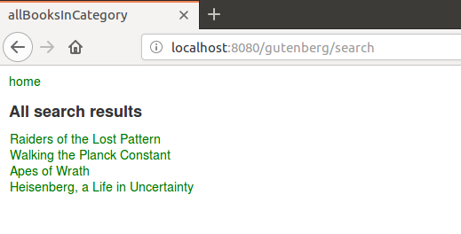

# gutenberg-rhapsody
I present here a microservice-oriented application that uses ElasticSearch as a schemaless database. It is a reengineering of a previous project that used MongoDB. It consists of a collection of separate RESTful servers.

Here are the prerequisites for running the complete application:

A recent Elasticsearch version installed (I used 6.6.0)
A recent Apache Maven version installed (I used 3.3.9)

In addition I used Spring Tool Suite for developing this demo but it is not required for running the application.

Here is the list of all 9 Spring Boot servers:

Server               | Port         | Function             | Database connection
-------------------- | ------------ | -------------------  | ----------------------------------
config-server        | 8888         | Configuration server | None
eureka-service       | 8761         | Discovery server     | None
book-server          | 8081         | Book requests        | gutenberg-books
review-server        | 8082         | Review requests      | gutenberg-reviews
order-server         | 8083         | Order requests       | gutenberg-orders
user-server          | 8084         | User requests        | gutenberg-users
zuul-server          | 5555         | Gateway              | None
admin-server         | 9090         | admin server         | gutenberg-books, gutenberg-orders
frontend-server      | 8080         | frontend             | None

# 1.1 ElasticSearch Maven dependencies

The only dependency to ElasticSearch is this one:

```
&lt;dependency>
    &lt;groupId>org.elasticsearch.client&lt;/groupId>
    &lt;artifactId>elasticsearch-rest-high-level-client&lt;/artifactId>
&lt;/dependency>
```

A gateway is used to hide the main RESTful servers. Here is the list:

Server           | Port | Gateway URI
---------------- | ---- | -------------------------
book-service     | 8081 | zuul-service:5555/books
review-service   | 8082 | zuul-service:5555/reviews
order-service    | 8083 | zuul-service:5555/orders
user-service     | 8084 | zuul-service:5555/users

Here are the steps to run the application:

# 1. Index creation

In folder elasticsearch run the 4 scripts:

```
./createBooks.sh
./createReviews.sh
./createOrders.sh
./createUsers.sh
```

It creates 4 indices named:

```
gutenberg-books
gutenberg-reviews
gutenberg-orders
gutenberg-users
```

All indices are prepopulated. Thanks to ElasticSearch RESTful API all indices can be explores using any browser or Postman tool.
For example connect to: 
```
http://localhost:9200/gutenberg-books/_search?size=20 
```
to see all existing books.


# 2. Running the application

In each folder:
```
config-server
eureka-service
book-server
review-server
order-server
user-server
zuul-server
admin-server
frontend-server
```

run the command: `mvn spring-boot:run`

This will create the 9 Spring Boot applications.

All running Spring Boot apps can be seen on Eureka port 8761.

The frontend itself is accessed on URL localhost:8080/gutenberg. A username and password are required. Here are the prepopulated users:

Username | Password
-------- | --------- 
Carol    | s1a2t3o4r 
Albert   | a5r6e7p8o
Werner   | t4e3n2e1t
Alice    | o8p7e6r5a
Richard  | r1o2t3a4s
Sator    | sator1234 
Arepo    | arepo1234
Tenet    | tenet1234
Opera    | opera1234
Rotas    | rotas1234

Here is a snapshot of the welcome page:


# 4. Searching for a book

Enter one or several keywords in the keywords field. Here is a snapshot of the books found for keywords `gorilla quantum pattern captain`. Note that gutenberg-books index is searched for matches in three distinct fields:

```
"title"
"description"
"tags"
```



# 5 Registering a new user

Click on register on Login page then fill the registration form. The username should not be already present in gutenberg-users  index. Once registered the new user can connect to frontend server.

# 5. Using admin-service
To access admin-service the best way is to use Postman or any similar application. The URI is localhost:9090/admin.

Here are two snapshots of Postman interaction:


